# Loading ESPHome on the TrampleTek Blue mat using [ESP Web tools](https://esphome.github.io/esp-web-tools/)

## These instructions are for default Home Assistant UI with the ESPHome add-on
If you are a Home Assistant power-user I suggest jumping to [Loading ESPHome on the TrampleTek mat](https://ascmats.github.io/mat_install.html) section and altering the directions and files as you need. If you are not a Home Assistant power-user yet, then these instructions are for you.

## (Warning) Easy Mode installation is dependent on web-based tools that might change, if they don't work jump to the [Loading ESPHome on the TrampleTek mat](https://ascmats.github.io/mat_install.html) section

## These are the step-by-step instructions

- ESP Web tools only work with Google Chrome or Microsoft Edge. Open another window of your browser, as it can be hard to read the instructions and use the ESP Web tool (it covers the webpage).

- Click the button labeled "Connect" right below this line to start the ESP Web tool:
<esp-web-install-button manifest="https://raw.githubusercontent.com/ASCKing9/TrampleTek-Blue-code/main/TrampleTekBlue.json" install-supported="">
        <i slot="unsupported">
          The option is not available because your browser does not support Web
          Serial. Open this page in Google Chrome or Microsoft Edge instead
            (but not on your iOS device).
        </i>
</esp-web-install-button>

- The below pop-up will appear asking to select the COM port for your mat. You can plug and un-plug your mat's USB cable into the computer you're using to see which COM port appears and disappears, pick that option and press "connect." (If you don't see anything showing up when you plug your USB cable into the computer you may have a USB driver issue, if you hit cancel a pop-up will give you some info on hope to install the right USB drivers).

 

My COM port was COM9 in this example.

- If the ESP Web tools succesfully connect to the device you will see this pop-up, click "Install TrampleTek Blue Firmware"

 

- You will get another pop-up to confirm, click "Install".

 

- At first it will say "Erasing" for a bit, and then it will start to install.

- After a few minutes it should be successful!

 

- Next it should ask for you Wi-Fi credentials, if you make a mistake it'll let you know.

- Once your Wi-Fi has been accepted you will see this, click on "skip".

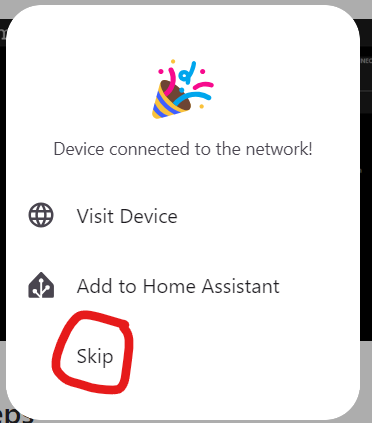

- Close the ESP Web tool.

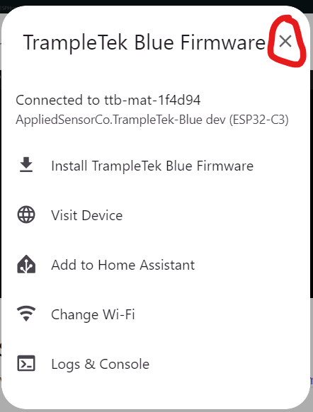 

- Open a Home Assistant tab, typically [http://homeassistant.local:8123/](http://homeassistant.local:8123/), and open ESPHome in the Settings -> Add-ons section.

- Select ESPHome.

- Open the Web UI.

- Your mat will have a green bar at the top, it will be called "TTBlue" with a string of numbers/letter after. Click on "Adopt".

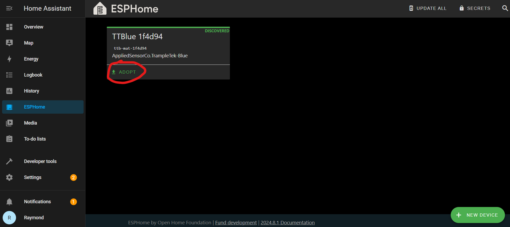 

- Give you mat a useful name, something short that describes where it is. I picked "TTB Garage" because it's in my garage. Click "Adopt".

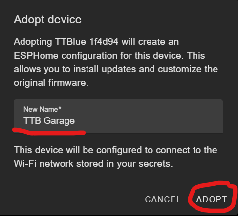 

- Now install with your new name! Click "Install".

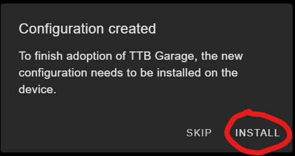 

- This part is going to take awhile, like 3-4+ minutes. It's going to build the code and then install it over Wi-Fi. Make sure your mat is in a good place for signal from your router. The underlined bar shows the progress of installing over the Wi-Fi.

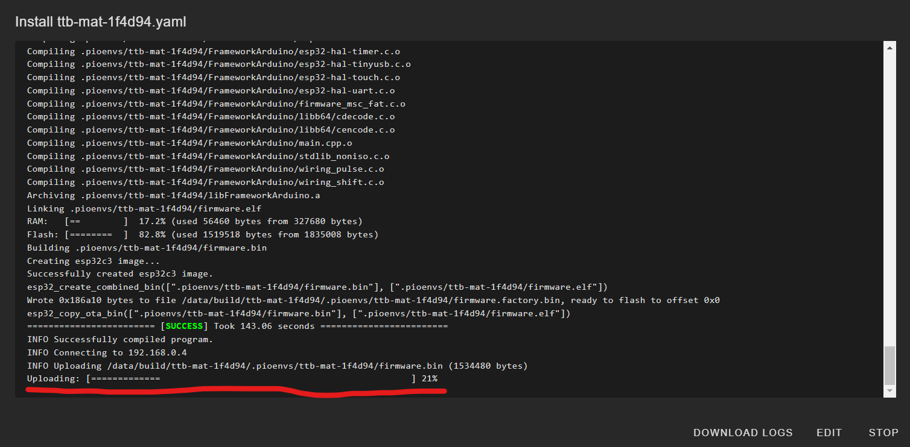
  
- Eventually you will see this. MAKE SURE TO WRITE DOWN YOUR IP Address, not the one in the picture. Yours will likely not be 192.168.0.4, but it may be very similar. Click "Stop" to leave this logger page.

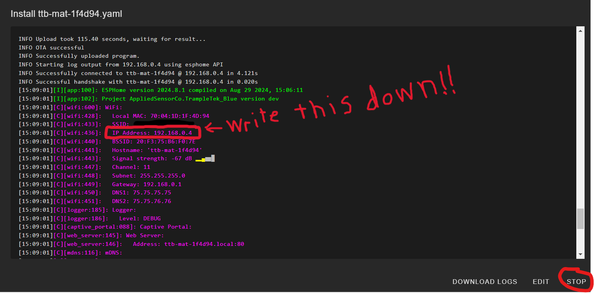 

If you missed your IP Address, you can also click on "visit" ESPHome card to find it out. The address will be in the web address bar at the top.

- Now we need to integrate the device into Home Assistant. Navigate with the left side bar to the Settings -> Devices & Services, click on configure under the new device you just set up. The device might show with the original name "TTB xxxxxx" or your adopted name, don't worry the name you picked will be displayed in main Home Assistant UI after this step. Click "Configure".

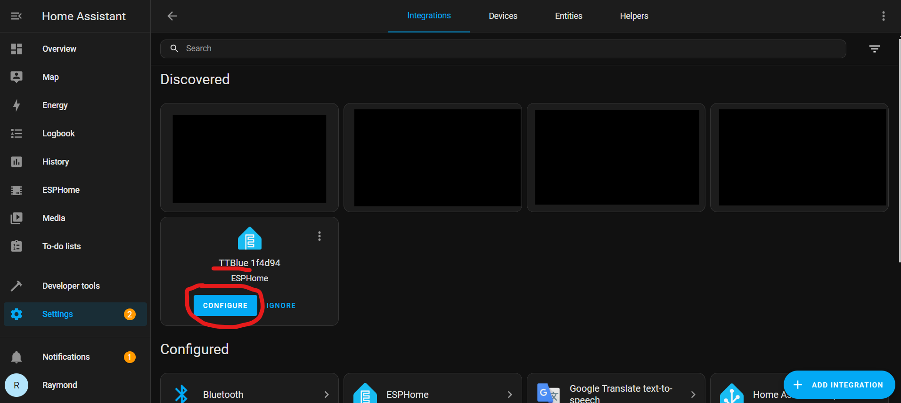

- One of two things might happen depending on your setup. You will get this option, where you just need to press submit (and yes, I changed the name of my mat to TTB Gray):

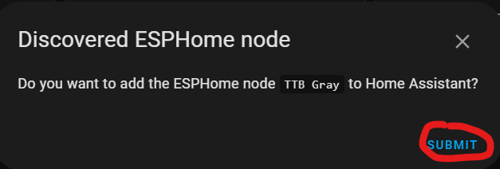 

- Or you might need to supply the device's IP address and ESPHome node port (which is defaultly 6053):

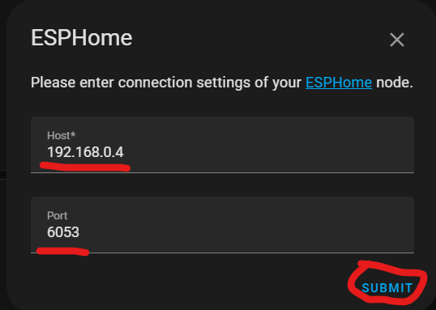

- Next pick where in Home Assistant you want to assign the device, click "Finish", and you're done installing your TrampleTek Blue mat!

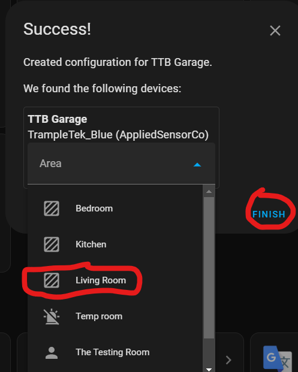

## Next Steps
Let's move on to [understanding the UI elements of the TrampleTek Blue (Home Assistant version)](https://ascmats.github.io/usingHAui.html).

