

# Loading ESPHome on the TrampleTek Blue mat using [ESP Web tools](https://esphome.github.io/esp-web-tools/)

## These instructions are for default Home Assistant UI with the ESPHome add-on
If you are a Home Assistant power-user I suggest jumping to [Loading ESPHome on the TrampleTek mat](https://ascmats.github.io/docs/Manual-Installation/mat_install.html) section and altering the directions and files as you need. If you are not a Home Assistant power-user yet, then these instructions are for you.

## (Warning) Easy Mode installation is dependent on web-based tools that might change. If this mode works, great(!), you can skip the Manual Install section. If this doesn't work jump to the [Manual Installation](https://ascmats.github.io/docs/Manual-Installation/) section.

## These are the step-by-step instructions

- ESP Web tools only work with Google Chrome or Microsoft Edge. Open another window of your browser, as it can be hard to read the instructions and use the ESP Web tool (it covers the webpage).

- Click the button labeled "TrampleTek Blue Firmware install button" right below this line to start the ESP Web tool:
  
<esp-web-install-button manifest="https://raw.githubusercontent.com/ASCKing9/TrampleTek-Blue-code/main/TrampleTekBlue.json" install-supported="">
        <button slot="activate">TrampleTek Blue Firmware install button</button>
        <i slot="unsupported">
          The option is not available because your browser does not support Web
          Serial. Open this page in Google Chrome or Microsoft Edge instead
            (but not on your iOS device).
        </i>
</esp-web-install-button>

- The below pop-up will appear asking to select the COM port for your mat. You can plug and un-plug your mat's USB cable into the computer you're using to see which COM port appears and disappears, pick that option and press "connect." (If you don't see anything showing up when you plug your USB cable into the computer you may have a USB driver issue, if you hit cancel a pop-up will give you some info on hope to install the right USB drivers).

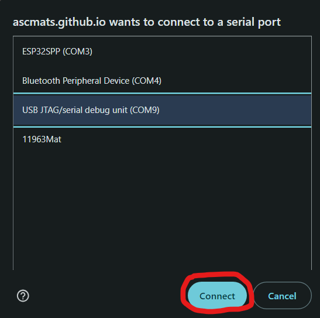 

My COM port was COM9 in this example.

- If the ESP Web tools succesfully connect to the device you will see this pop-up, click "Install TrampleTek Blue Firmware"

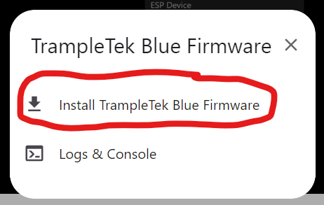 

- You will get another pop-up to confirm, click "Install" (firmware version will be different than this image).
### WARNING! I'VE BEEN GETTING REPORTS OF BROSWER CRASHES AFTER THE INSTALL STEP COMPLETES (3/10/25). If that happens, open this page back up and press the "Connect" button at the top of this page again, select your COM port, then click on "Connect to Wi-Fi" to continue through the instructions. The firmware is installed, something is just going wrong with the ESP web tool and it's crashing the broswer.

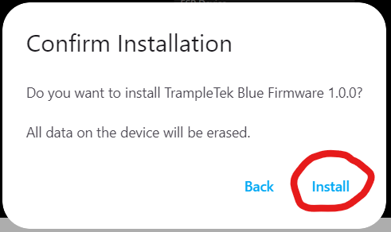 

- At first it will say "Erasing" for a bit, and then it will start to install.

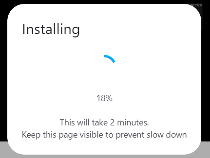

- After a few minutes it should be successful!

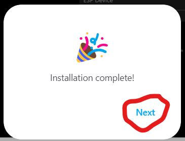 

- Next it should ask for you Wi-Fi credentials, if you make a mistake it'll let you know.

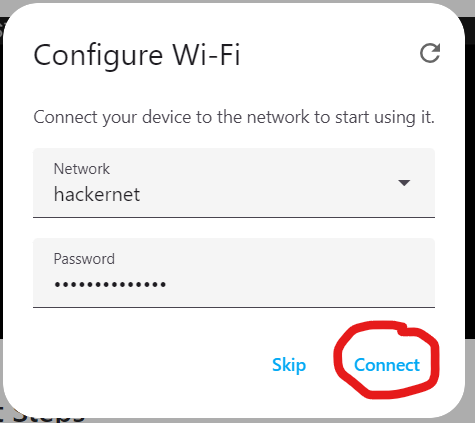

- Once your Wi-Fi has been accepted there are several ways to integrate the mat into Home Assistant, this is easiest. Click on "Add to Home Assistant".

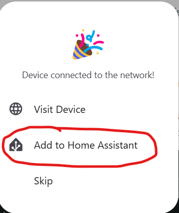

- That will open a new tab that wants to connect to the default web address for Home Assistant. Click on the "Open Link".

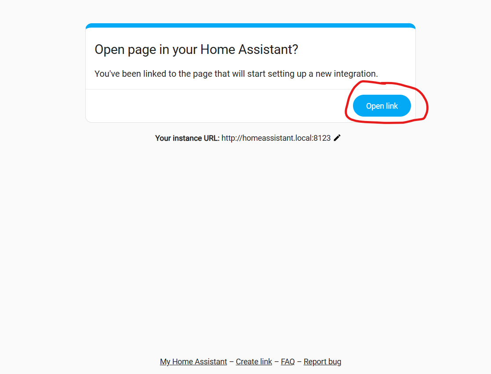

- This will jump you directly to your Settings --> Devices & Services page in Home Assisant. Click "Ok" to setup the device in ESPHome.

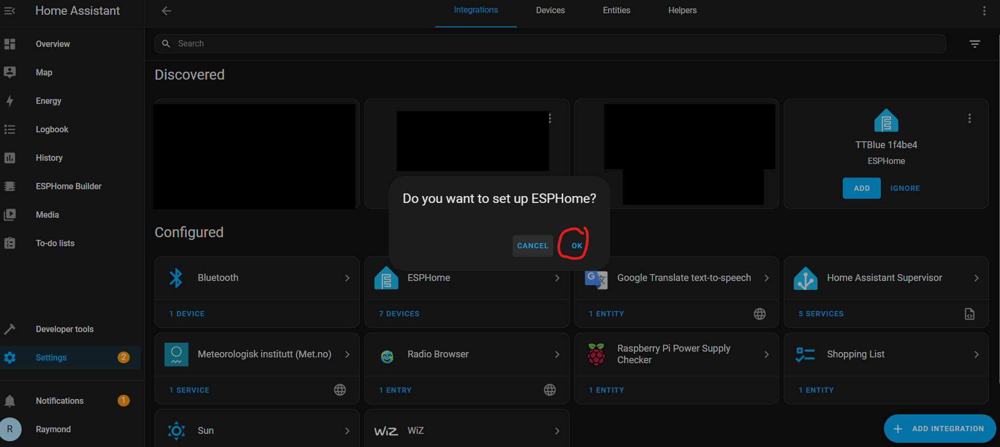

- Select the new TTBlue device.

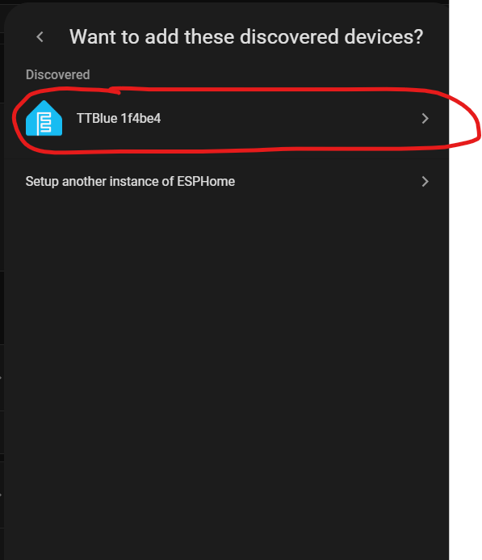

- Then you have to click submit.

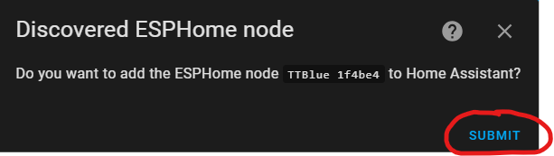

- Next pick where in Home Assistant you want to assign the device, click "Finish", and you're done installing your TrampleTek Blue mat!

- Your mat will have a unpleasant name of "TTBlue xxxxxx", if you want to change it I suggest manually going to each UI element in the Home Assistant Overview page and clicking on the gear icon. Alternatively you can "Take Control" of the device and it will automatically rename all the UI elements, but it's a little more complex. Instructions for that are here: [(Optional) Taking Control of the TrampleTek mat in ESPHome](https://ascmats.github.io/esphometakecontrol.html).

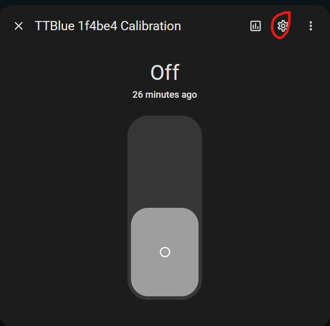

## Next Steps
If this worked, then you can **SKIP** the Manual Installation section and move directly to [understanding the UI elements of the TrampleTek Blue (Home Assistant version)](https://ascmats.github.io/usingHAui.html).

If you want to take full control of your TrampleTek Blue mat then check out these optional instructions [(Optional) Taking Control of the TrampleTek mat in ESPHome](https://ascmats.github.io/esphometakecontrol.html)

Please join the [ASC Discord server](https://discord.gg/cB9P6NmYJg) if you have questions or comments about this page.

