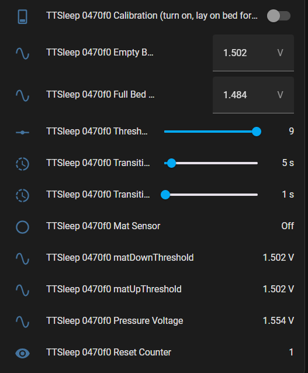

# Are you part of the SlumberTek early access open beta?
If not, you're in the wrong place!

## If you would like to join the SlumberTek beta please join the ASC Discord ([invite link](https://discord.gg/cB9P6NmYJg)) or email Raymond@asc.com

## These are the step-by-step instructions to install the SlumberTek Beta firmware:

- Open a browser tab with the [Easy Model Installation](https://ascmats.github.io/EasyModeInstall.html) because you'll be using the "connect" button below and then following the Easy Mode Installation right at the "The below pop-up" step.

- Note that ESP Web tools only work with Google Chrome or Microsoft Edge.

- Click the button labeled "Connect" right below this line to start the ESP Web tool:
<esp-web-install-button manifest="https://raw.githubusercontent.com/ASCKing9/TrampleTek-Blue-code/refs/heads/main/TrampleTek_Debug/SleepMatBeta/TrampleTek_Sleep.json" install-supported="">
        <i slot="unsupported">
          The option is not available because your browser does not support Web
          Serial. Open this page in Google Chrome or Microsoft Edge instead
            (but not on your iOS device).
        </i>
</esp-web-install-button>

- Now follow the [Easy Model Installation](https://ascmats.github.io/EasyModeInstall.html) instructions. You'll know you've installed the TT-Sleep code because you'll see the name of the firmware in the install menus - **"TrampleTek Sleep Firmware"**.

## UI element explanation (as of Firmware update 0.1.3 - 2/20/25)

### Threshold Convergence Factor
The sensor's baseline voltage typically drifts up and down everyday, so the "Empty Bed" and "Full Bed" thresholds are adjusted every 8 hours based on the previous 24 hours data to keep the sensor more accurate across days. After estimating the updated thresholds from the last 24hrs' data the "Convergence factor" shrinks the gap between the new thresholds. A "10" reduction factor sets both the new thresholds to the same value, which I don't think would work well 🤔, but everything is being tested because it's a beta test! The slider exists to experiment with what values work best for people!

### Calibration (turn on, lay on bed for at least 30s, get out of bed, turn off)
This helps set the thresholds for your bed the first time you use the sensor, or as a reset if the voltage drift is so far off that the bed sensor is no longer accurate at all.

### Empty Bed value
For this firmware version, this is the only trigger for turning off the "Mat Sensor" binary sensor. The "Pressure Voltage" must be above the "Empty Bed Value" for the full duration of the "Transition to Off Delay" value before the "Mat Sensor" is turned *off*.

This value is fully adjustable to tweak the thresholds manually if needed, however the automatic threshold will take over after the next 8 hour period.

### Full Bed value
For this firmware version, this is one of the triggers for turning on the "Mat Sensor" binary sensor. If the "Pressure Voltage" is below the "Full Bed Value" for the full duration of the "Transition to On Delay" value before the "Mat Sensor" is turned *on*.

### Transition to Off Delay
This is the amount of time the "Pressure Voltage" must be above the "Empty Threshold" before triggering an "Off". I suggest this value be at least 5-10 seconds, as big motions in the night often cause really big 'Pressure Voltage' spikes upwards, and this helps to prevent 'Off' triggers from brief nighttime movements. 

### Transition to On Delay
This is the amount of time the "Pressure Voltage" must be below either the "Full Bed Threshold" or the "matDownThreshold". Typically this value can safely be 5 seconds or less because the Pressure Voltage doesn't spike down unless someone is getting in bed.

### Mat Sensor
Binary sensor that says when someone is in bed or not.

### MatDownThreshold (Beta debug info)
This dynamic threshold moves with the "Pressure Voltage" signal. Increasing the "Sensitivity" makes the "MatDown Threshold" follow closer to the Pressure Voltage. The mats are typically less responsive to getting into bed and it can take a while for the "Pressure Voltage" to settle down to the level of the "Full Bed Threshold" or below. So this threshold helps to quickly trigger that first time you get into bed, which is often a smaller signal than getting out of bed.

### MatUpThreshold (Beta debug info)
This dynamic threshold moves with the "Pressure Voltage" signal. This dynamic threshold is similar to the "MatDownThreshold" except it helps to trigger off signals to "Mat Sensor" faster. However, this was causing a decent amount of false negative (I'm still in bed but the "Mat Sensor" says I'm out of bed), so for now (firmware ver. 0.1.0) this is not a dynamic threshold and is fixed to the "Empty Bed value" threshold.

### Pressure Voltage
This is the signal coming off the mat! All logic and "Mat Sensor" decisions are made from the changes of this value.

### Reset Counter (Beta debug info)
This helps keep track of how often the device is restarting because of a glitch.

## Diagnostic only UI elements (only visible if you go into the ESPHome device settings)

### Detection Sensitivity (Higher is more sensitive)
Increasing this value causes the "matDownThreshold" and "matUpThreshold" to pull in closer to the "Pressure Voltage", which causes the likelihood of triggering on or off of the "Mat Sensor" from the more dynamic "matDownThreshold" and "matUpThreshold" instead of the more static "Empty Bed value" and "Full Bed value".

This UI element was mostly for debugging and will likely be removed in the future.

### Internal Temperature
The temperature of the CPU.

### WiFi Signal Strength
WiFi connection strength to your device, larger than -60dB is not good.

## Next Steps
If this worked, great! If not, ask in the Discord for help or email me directly at Raymond@asc.com.

Join the [ASC Discord server](https://discord.gg/cB9P6NmYJg) if you have questions or comments about this page.

