# Instructions for reverting the TrampleTek Blue mat back to being Smart Socket only

These steps will revert the mat back to its original programming so it can be used with a TrampleTek Blue socket.

- First, click this [link to directly download](https://github.com/ASCKing9/TrampleTek-Blue-code/raw/refs/heads/main/TrampleTekBlueToothSocket.bin) the TrampleTekBlueToothSocket.bin from the Github [TrampleTek-Blue-code repo](https://github.com/ASCKing9/TrampleTek-Blue-code). It will go to whatever your default download folder is.

- Next, we will need to download the Espressif Flash Download Tools from [here](https://www.espressif.com/en/support/download/other-tools). Find the Flash Download Tools line and click on the download arrow.

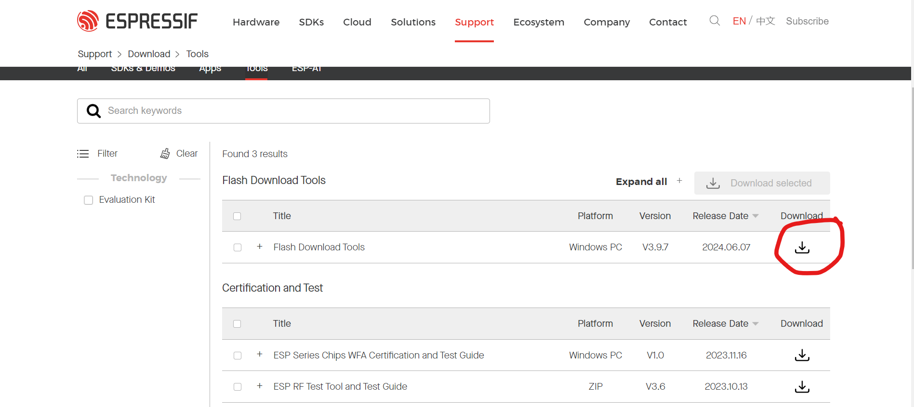
(This is what the page looked like 9/20/24)

- After it downloads, extract the compressed (zipped) folder by right-clicking on the file and picking extract (or unzip on some computers).

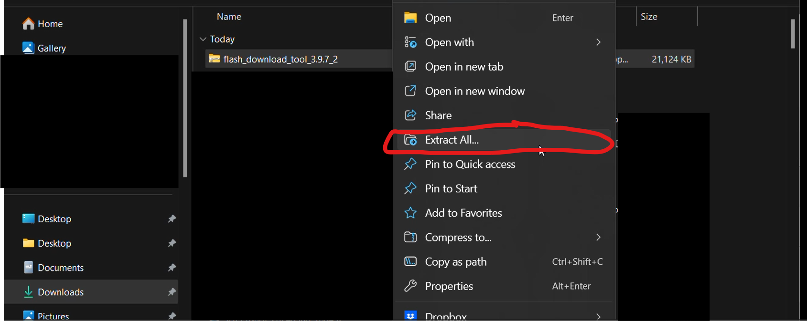

- Your window may look different, but in the end extract the files to what ever folder you want.

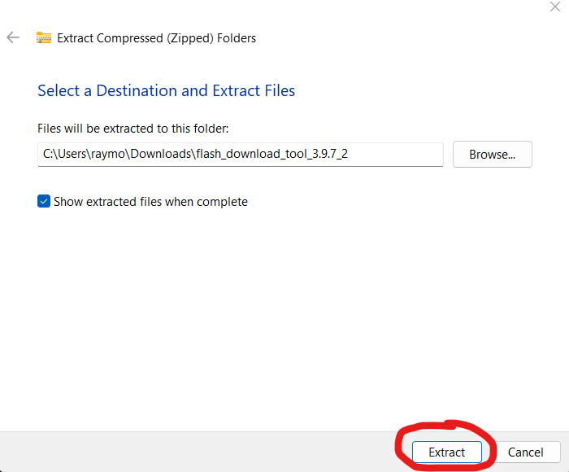

- Open your newly extracted folder and open the file named flash_download_tool_3.9.7 (the number may change in future updates, but it should still be called flash_download_tool_(numbers)).

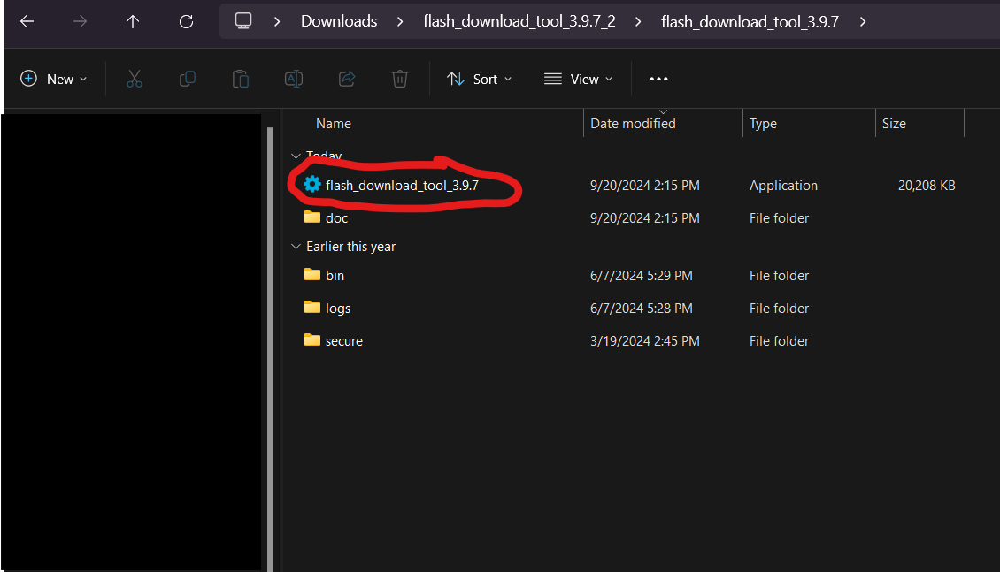

-	After it opens you'll need to pick (1) ChipType - pick ESP32-C3, (2) WorkMode - Develop, and (3) LoadMode - USB.
-	Click "OK"

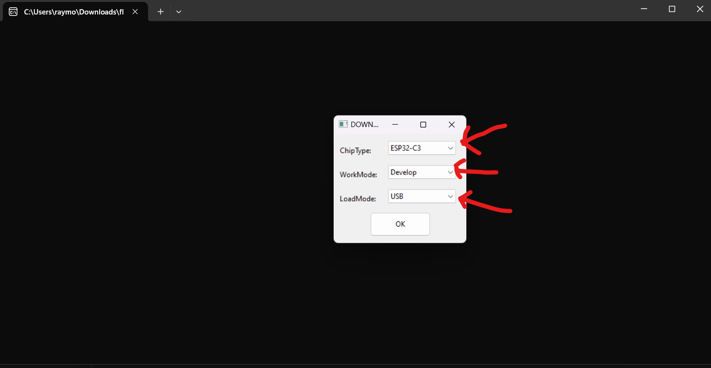   

- That will open this window, frequently I need to expand the window to see the bottom area options.

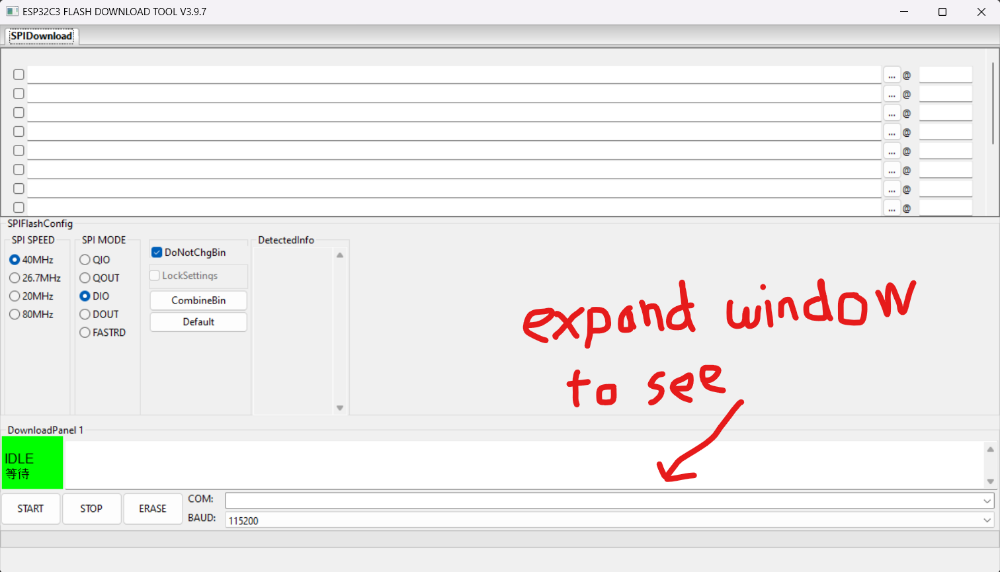  

- Click on the three dots on the top line of the long white boxes.

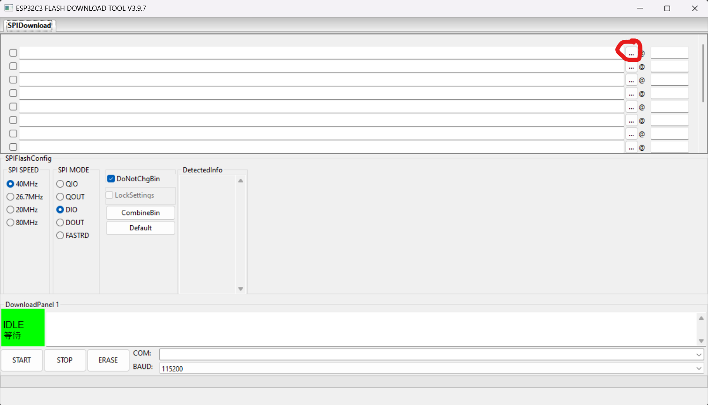  

- This will open a file selector window, navigate to where you downloaded the [TrampleTekBlueToothSocket.bin](https://github.com/ASCKing9/TrampleTek-Blue-code/raw/refs/heads/main/TrampleTekBlueToothSocket.bin) from the first step, and click open.

  

- Now click the check box on the left and type "0x0" into the box on the right. The box areas should turn green once you've done this.

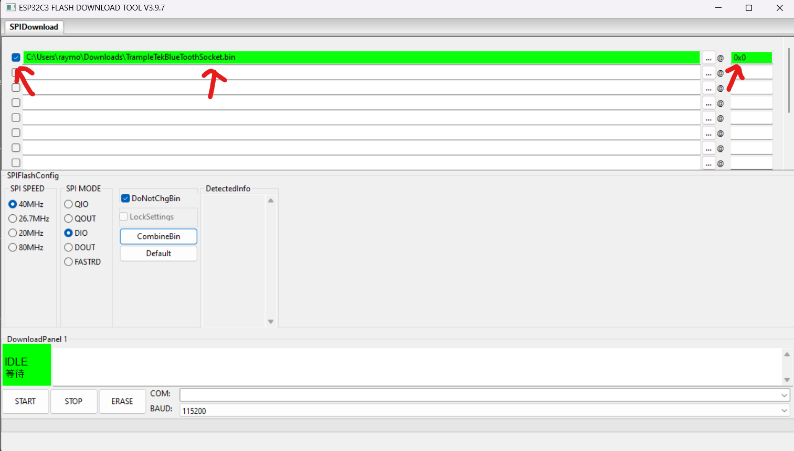

- Now you need to pick your COM port, if you haven't connected your mat to your computer using the USB cable, do so now.
- If you don't know which COM port is the right one, unplug the mat and open the COM port drop down menu and take note of the COM ports. Then, click away (to close the COM port drop down menu), plug in your mat, and re-open the COM port drop down menu. Check to see if any new COM port numbers have shown up. If yes, that's the mat's COM port, select it.

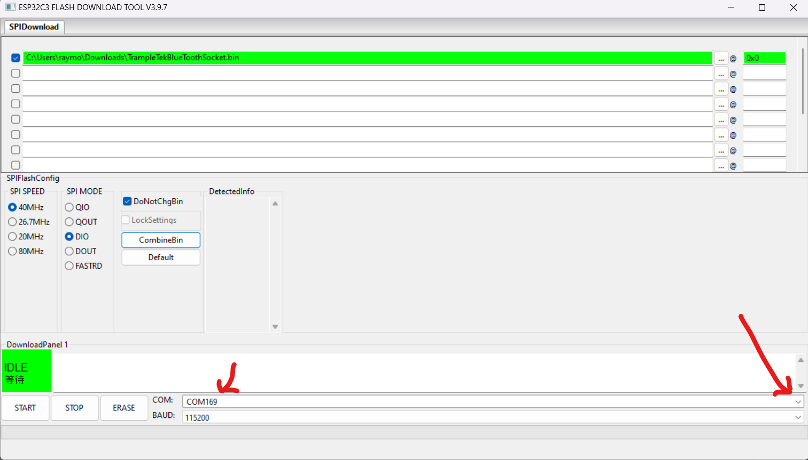 

- Press the "Start" button.

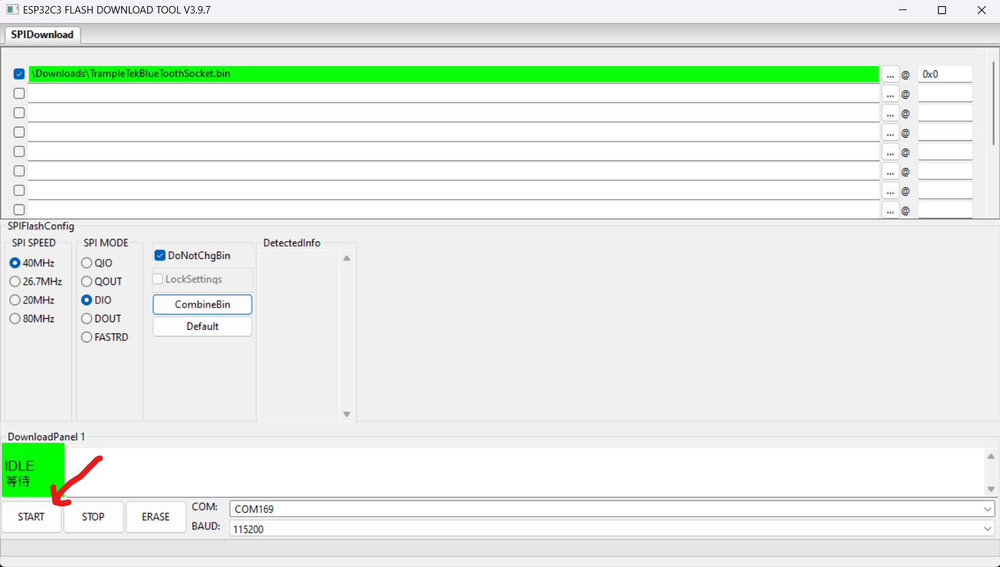  

- If everything is working right you'll see this progress bar start moving after a few seconds.

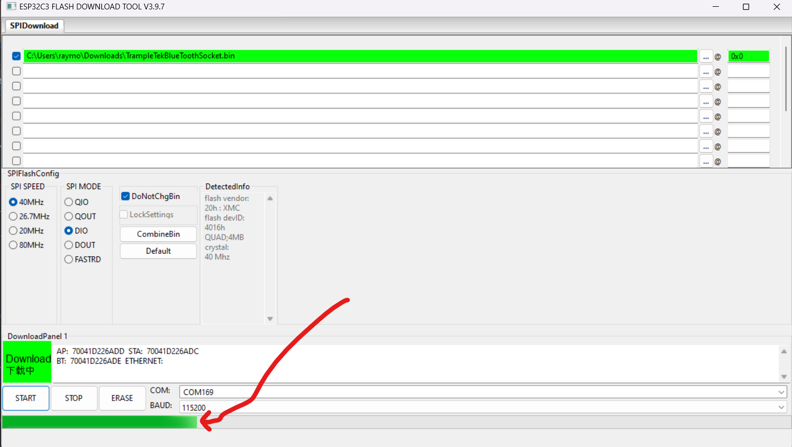 

- When it's finished you've succesfully uploaded the original TrampleTek Blue code!

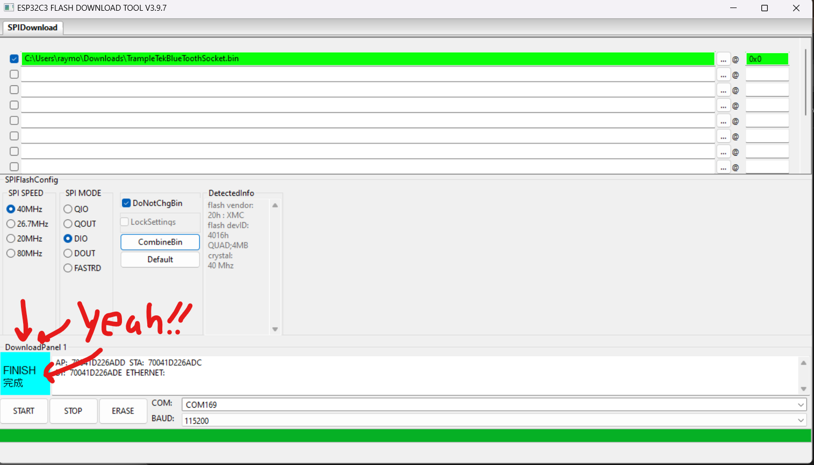

## Now unplug and re-plug in the mat and you'll see the blue light start flashing, this indicates that it's searching for a nearby TrampleTek Blue socket to pair with! Plug in your original TrampleTek Blue socket nearby and you're all ready to go.

## Go [here](https://github.com/ASCKing9/TrampleTek-Blue-code/blob/main/TrampleTekBlue_socketVerison/TrampleTek%20Instructions%20Brochure%20reduced%20color.pdf) for the original TrampleTek Blue instruction manual.

