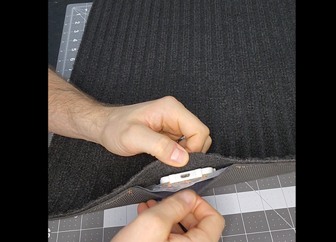
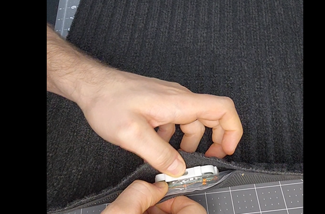
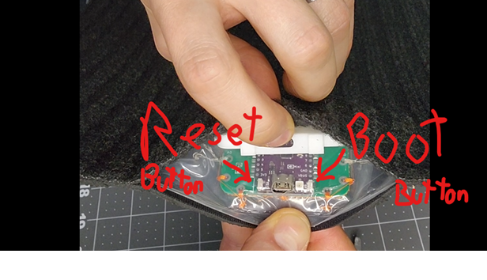
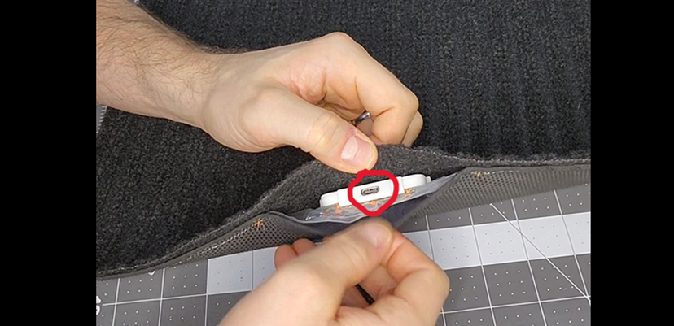

# Instructions for putting the mat into Boot Mode

## This should not be necessary for most people, but all computer setups are different and putting the mat into Boot Mode enables it to accept the new code from ESPHome.

- Disconnect the USB-C cable and pop off the protective cover of the circuit board.

  

-	There is a long plastic clip on the front and back of the protective box keeping it snapped to the circuit board. It’s tight but pry up the front of the protective box to pop it off.
 

-	With the protective cover off plug the cable back in. You then must hold the “Boot” button (it is a small sideways button on the right) and while the “Boot” button is held down you must press and release the “Reset” button (the small sideways button on the left).

  

-	You will need to go through the installation instruction steps and get back to this screen, and install!

 

-	If this step fails try doing the “Boot and reset” sequence again, as the circuit board may not have made it to Boot Mode. The buttons are a little hard to press, you should feel a slight click when you press them down. 

-	If it the install step worked, you’ll start seeing loading:

 

-	When it’s done you’ll see this!

## Put the protective cover back onto the circuit board before moving to the next steps.

 

Unplug the USB-C cable and clip the protective cover back onto the circuit board. Make sure the USB-C connection hole in the protective cover is aligned with the cutout in the waterproofing plastic sheet before squeezing the protective to snap it back into place. Plug the USB-C cable back in and continue to the next steps.

## Next Steps
Let's move on to setting up the YAML code on the mat [Yaml Code Installation](https://ascmats.github.io/yamlcode.html).

