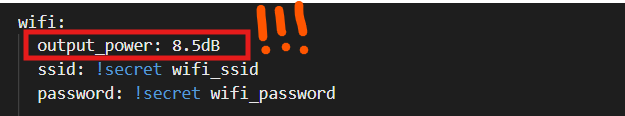

# CRITICAL FIX

## Over The Air (OTA) updates and WiFi connectivity will not work well unless this line is added to YAML code:

This a known issue with the [boards](https://www.wemos.cc/en/latest/c3/c3_mini.html) we are using for the mat, (more details [here](https://community.home-assistant.io/t/unable-to-connect-to-wifi-auth-expired-and-association-expired/678570/2)).

## If you skip the rest of the setup because you're an expert, please don't skip this step!

In the future we may move away from these boards because of this issue, but it doesn't seem to impact the Wi-Fi range that much and it does make the connect stable.

Moving on to the [Installation process](https://ascmats.github.io/mat_install.html)!
