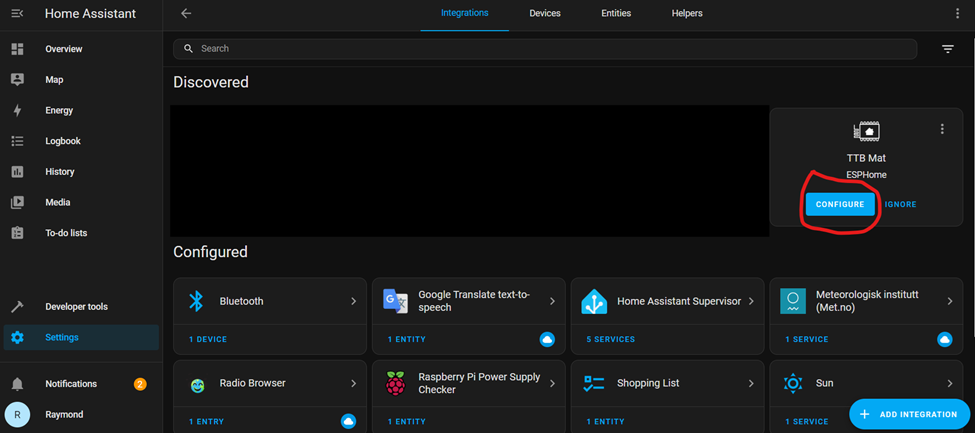
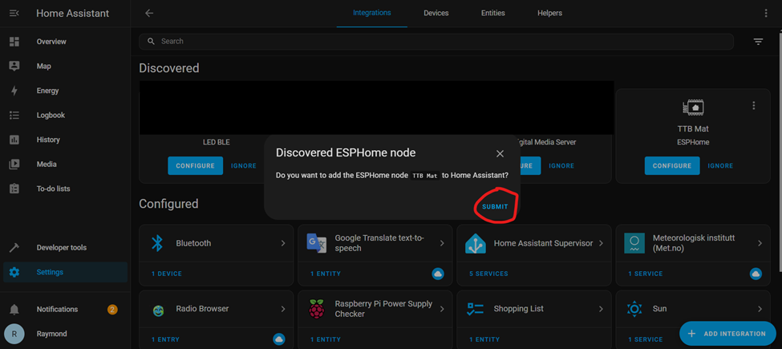
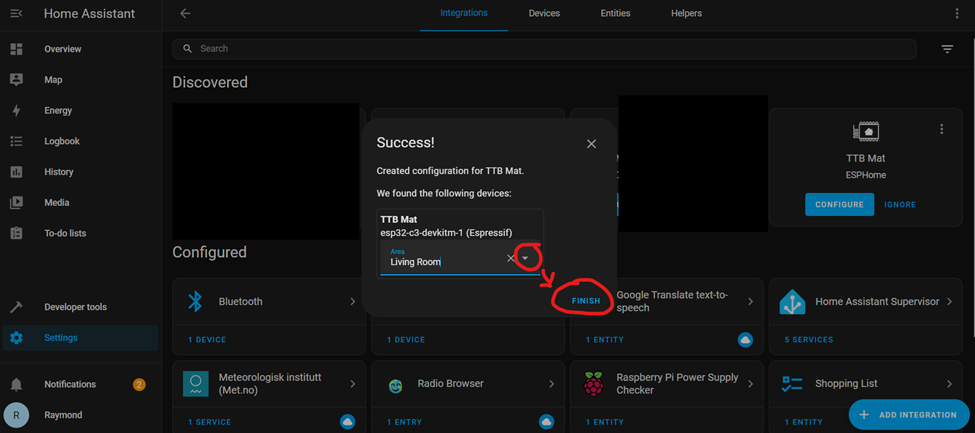

# Instructions for configuring the TrampleTek mat into the Home Assistant UI

- Go to the ESPHome integration in Settings -> Devices & Services, click on configure under the new device you just set up:

- Home Assistant will ask if you really want to add this device, press submit:

- Pick an area in your dashboard for the device and press finish:

 

- Go back to your dashboard and you should see some sensor details. If it looks odd, try refreshing the dashboard a few times.

The default UI elements should look something like this.

## Next Steps
Now let's do a double check that you added the [Wifi critical fix](https://ascmats.github.io/docs/Manual-Installation/critical_wifi.html).

Please join the [ASC Discord server](https://discord.gg/cB9P6NmYJg) if you have questions or comments about this page.
