# Instructions for installing the YAML code onto the TrampleTek mat

- At this point you have the is mat registered with Home Assistant(!) and it may prompt you that a new device was discovered. If you add the device now it won’t do anything, as it doesn’t have any ability to trigger any of your devices, that’s what the YAML code does. 

-	You can close your open ESPHome Web browser tab for now and get back to the ESPHome Open Web UI. (Main Home Assistant page -> settings-> add-on -> ESPHome -> Open Web UI). You may need to wait or refresh this screen a few times until your device shows up as “Online”

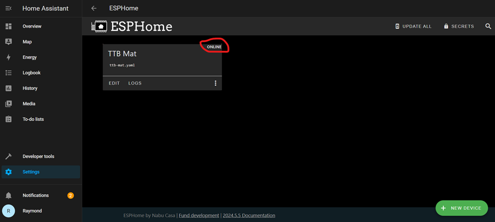 

-	Click on “EDIT” to add your Wi-Fi settings and the firmware to run the mat!

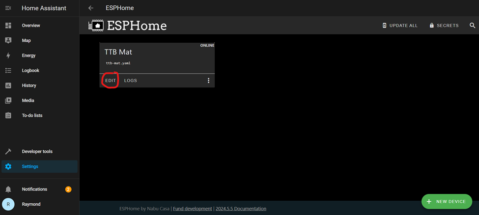 

-	This will open up the YAML code for your mat, and you should see something like this (I’m not worried about showing sensitive details here because I’ll be remaking this device with different values in the future):

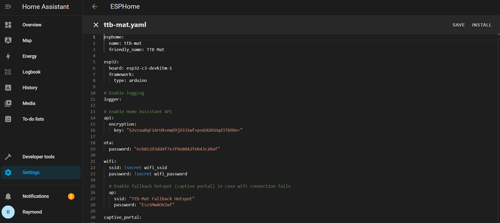 

## VERY IMPORTANT, MAT MAY NOT WORK WITHOUT DOING THIS STEP CORRECTLY
- First we need to add this line in the Wi-Fi section: “output_power: 8.5dB” (details about why [here](https://community.home-assistant.io/t/unable-to-connect-to-wifi-auth-expired-and-association-expired/678570/2)). We have to do this because there is a possible issue with the board's Wi-Fi and this helps to fix that issue. Click save after adding the “output_power: 8.5dB” line.
 
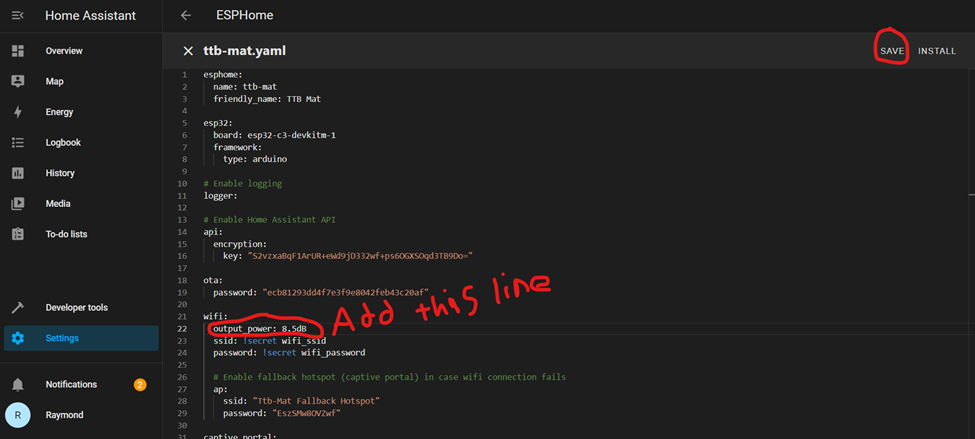 

- Next you need to put in your Wi-Fi credentials. You can either put your details directly into this file (you must have double quotations around the SSID and the password) or use the secrets.yaml file (optional steps below).

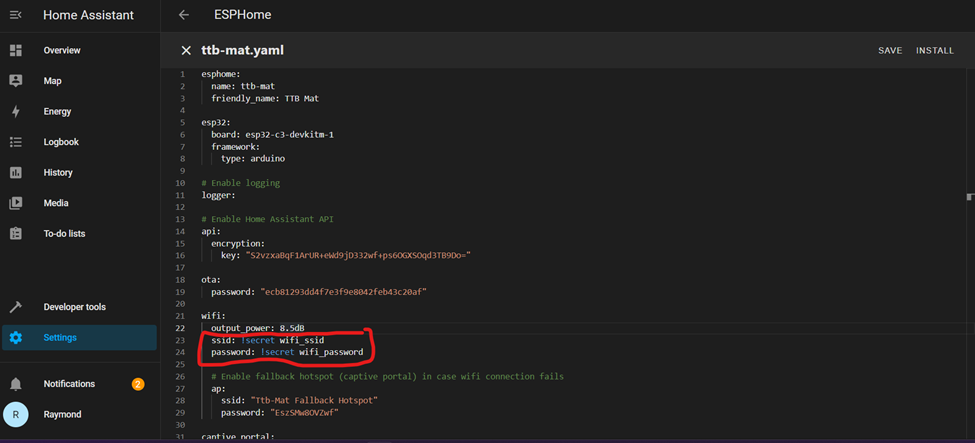 

- (Optional, using secrets.yaml) Get to the Open Web UI view and click on “Secrets” in the top right corner. 

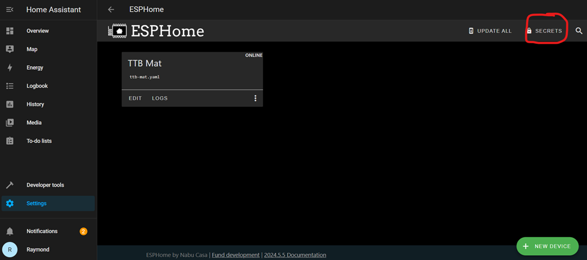 

-	(Optional, using secrets.yaml) If this file is empty, follow the structure of the information in the image and put in your SSID and password inside the double quotations just like the made up Wi-Fi details below. Click Save.

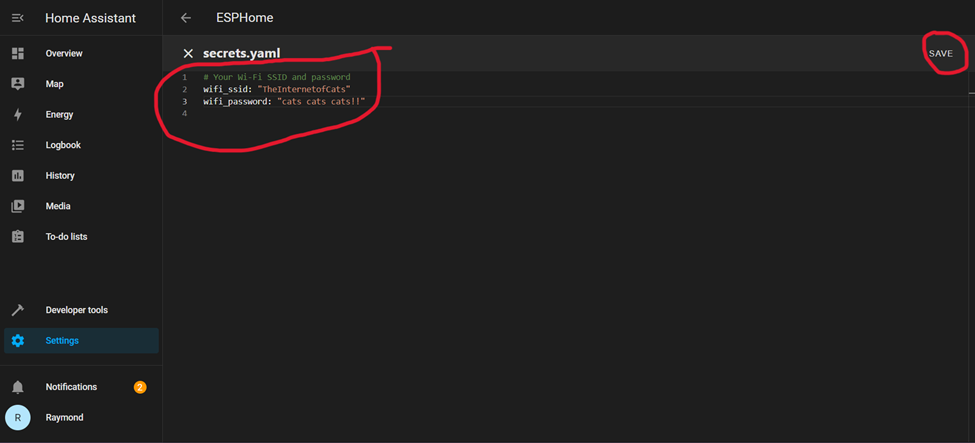 

- We need to alter one more place in the code, in the **"<ins>esphome:" section</ins>**.

 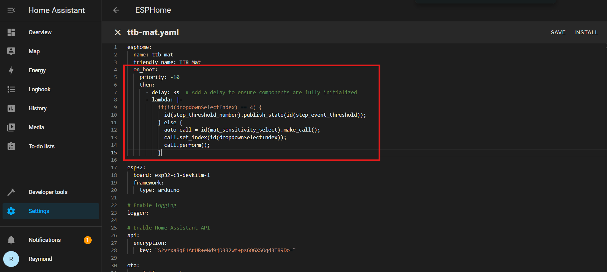 
 
I've found ESPHome's internal restoring of variables to be flaky, this will help your mat keep your calibration settings after an unexpected on/off event. You can copy/paste these lines from the main TrampleTek Blue (Home Assistant version) file [here](https://github.com/ASCKing9/TrampleTek-Blue-code/blob/main/TrampleTek_ESPHome.yaml), make sure to the match the indent amount for each line!

-	Starting at the line **"<ins>globals:</ins>"**, copy the code from main TrampleTek Blue (Home Assistant version) file [here](https://github.com/ASCKing9/TrampleTek-Blue-code/blob/main/TrampleTek_ESPHome.yaml), scroll down to the bottom of your YAML file and paste in the code. 

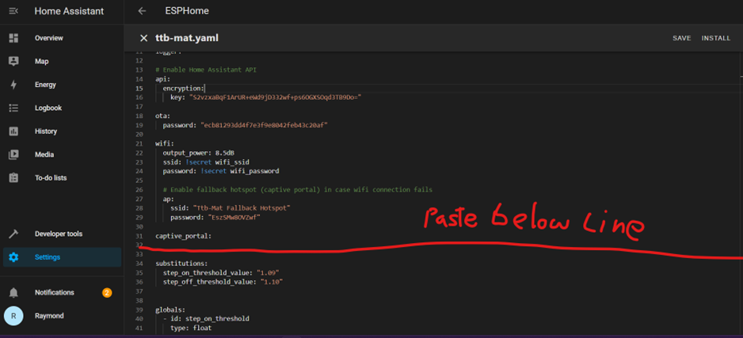 

-	Save and upload:

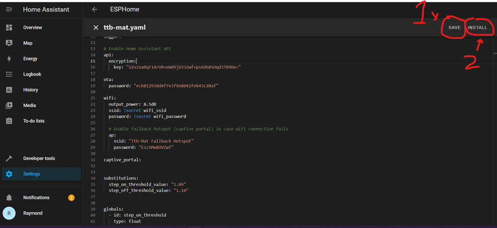 
 
-	You will be prompted with the install list, we will use “Plug into the computer” again. Follow the same steps we used previously to install the new YAML code onto the mat (the [your mat’s name].bin will have the same name).

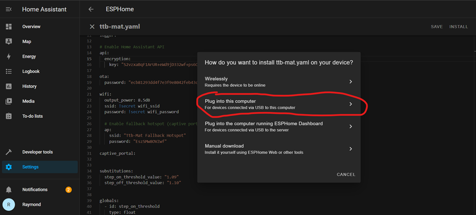 

- The following steps are a repeat of the previous section, I will just put the images here as a reminder. If you need the full guide, go back to the [Loading ESPHome on the TrampleTek mat](https://ascmats.github.io/docs/Manual-Installation/mat_install.html) on the side navigation bar.

 

 

  

 

  

 

 

 

 

If this step fails go to [Boot Mode Instructions](https://ascmats.github.io/bootmode.html).

 

 
-	 After you finish installing, you can close out of ESPHome Web tab and navigate back to the ESPHome Open Web UI and click on “LOGS”. (Main Home Assistant page -> settings-> add-on -> ESPHome -> Open Web UI).

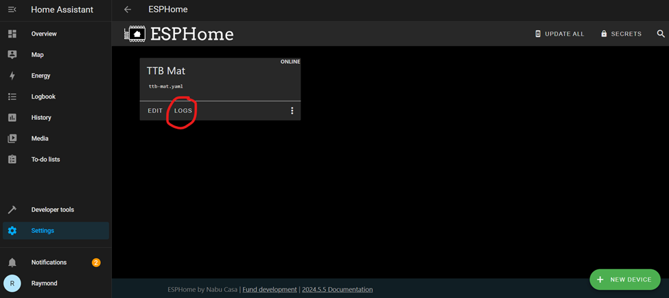 
 
-	 If everything was successful, you should see your Wi-Fi details in the log, along with a stream of data coming out of the mat. The mat is successfully connected and sending data to Home Assistant!

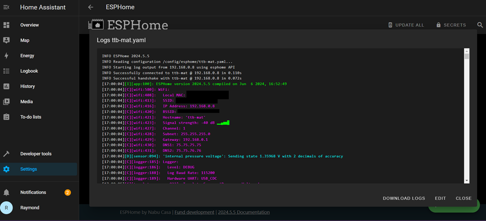 
 
-	NOTE: If you ever need to save and install any changes to the YAML code, you should be able to use the “Wirelessly” install option moving forward. With the “output_power: 8.5dB” line in your YAML the wireless connection should be stable enough to use this option.)

## Next Steps
Let's move on to [configuring the mat into the Home Assistant UI](https://ascmats.github.io/docs/Manual-Installation/HAintegration.html).

