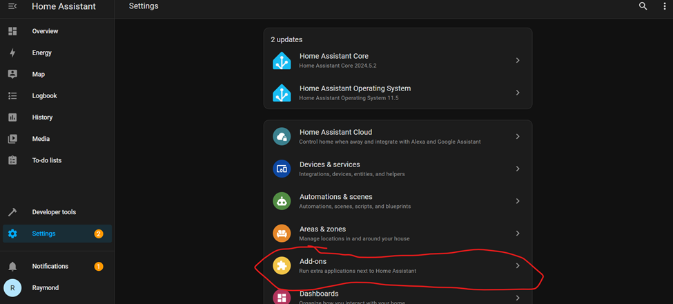
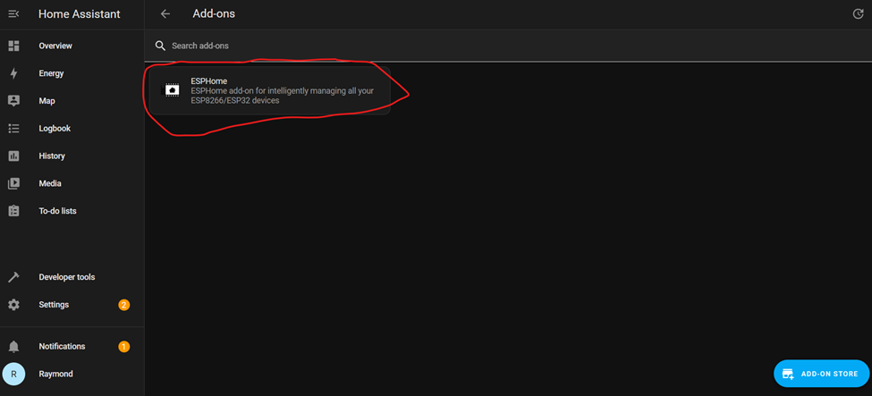
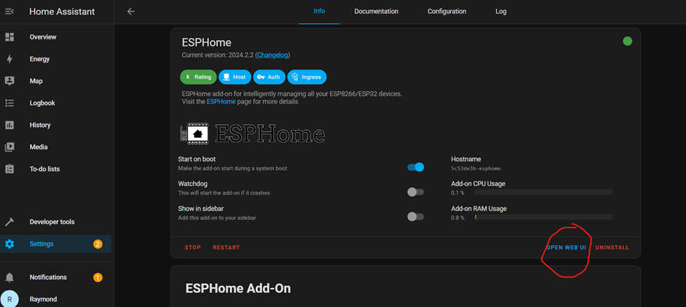
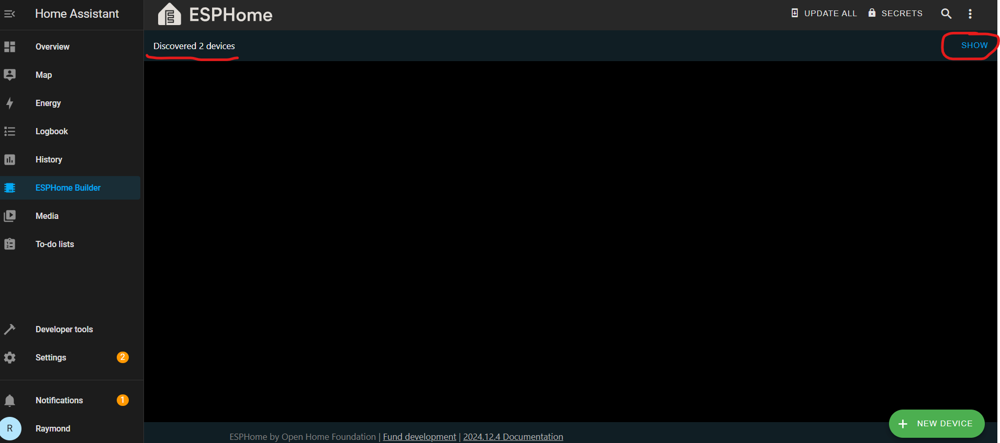
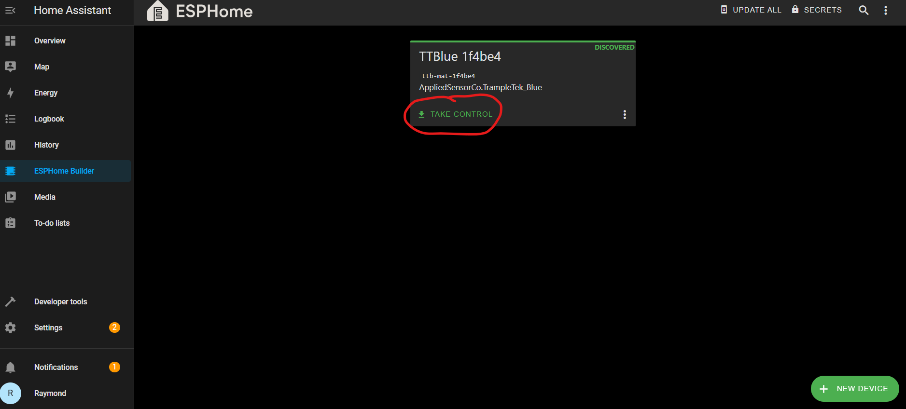
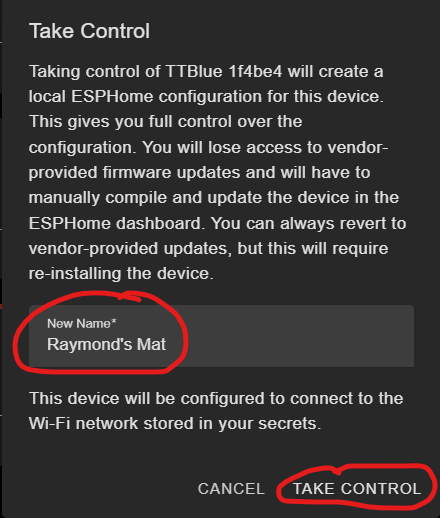
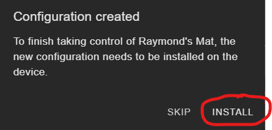
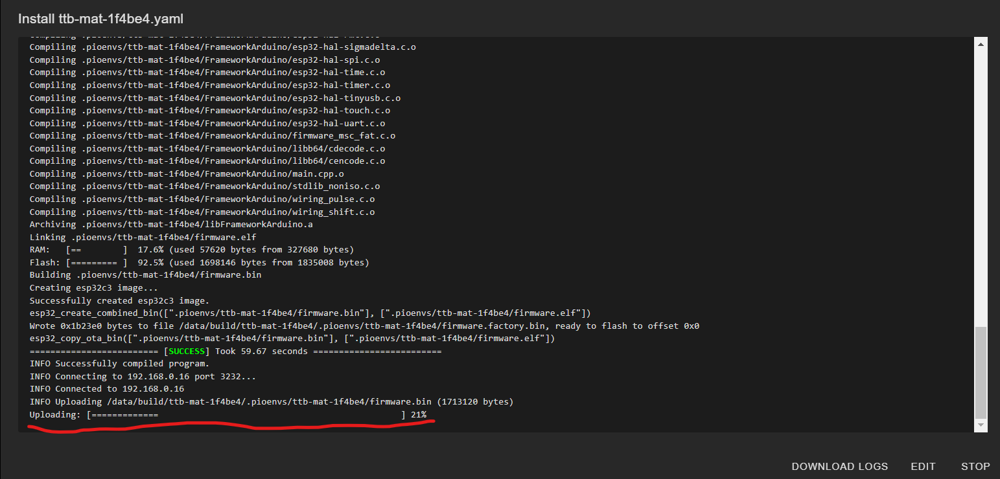
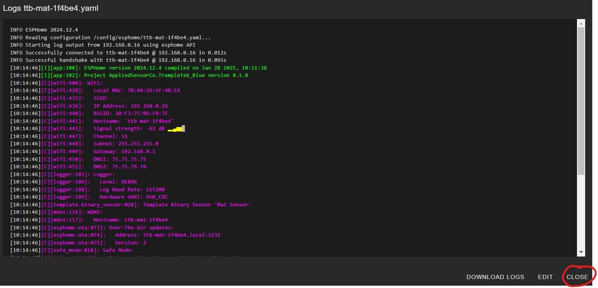

# (Optional) Taking Control of the TrampleTek mat in ESPHome

## These instructions are optional and only if you want to view device Logs and edit the YAML code directly after doing the [Easy Mode Installation](https://ascmats.github.io/EasyModeInstall.html).

## These are step-by-step instructions to "Take Control" of your TrampleTek Blue device in ESPHome.

- Open a Home Assistant tab, typically [http://homeassistant.local:8123/](http://homeassistant.local:8123/), and open ESPHome in the Settings -> Add-ons section.

- Select ESPHome.

- Open the Web UI.

- Your mat will be discovered, but hidden. Click on the "Show" in the top right corner.

 

- Click on the "Take Control" once you see the device.

 

- Give your mat a useful name. I find short but descriptive is best, I picked "Raymond's Mat". Click "Take Control".

 

- Now install with your new name! Click "Install".

 

- This part is going to take awhile, like 3-4+ minutes. It's going to build the code and then install it over Wi-Fi. Make sure your mat is in a good place for signal from your router. The underlined bar shows the progress of installing over the Wi-Fi. Sometimes this step fails, go to the bottom of this page for help.

  
- Eventually you should see this, and you can close the window. Your device's UI element names should all be updated with your new name, and you can view the YAML code and device logs in the ESPHome UI.

 

### I have seen an wifi install error that says something like "Error resolving IP address: Error resolving address with mDNS:" when trying to "Take Control". Make sure your ESPHome SECRETS has your wifi information, look for details about setting up your ESPHome SECRETS in the [YAML Code Installation](https://ascmats.github.io/docs/Manual-Installation/yamlcode.html) section of the Manual Installation section.

## Next Steps
**SKIP** the Manual Installation section and move directly to [understanding the UI elements of the TrampleTek Blue (Home Assistant version)](https://ascmats.github.io/usingHAui.html).

Please join the [ASC Discord server](https://discord.gg/cB9P6NmYJg) if you have questions or comments about this page.
