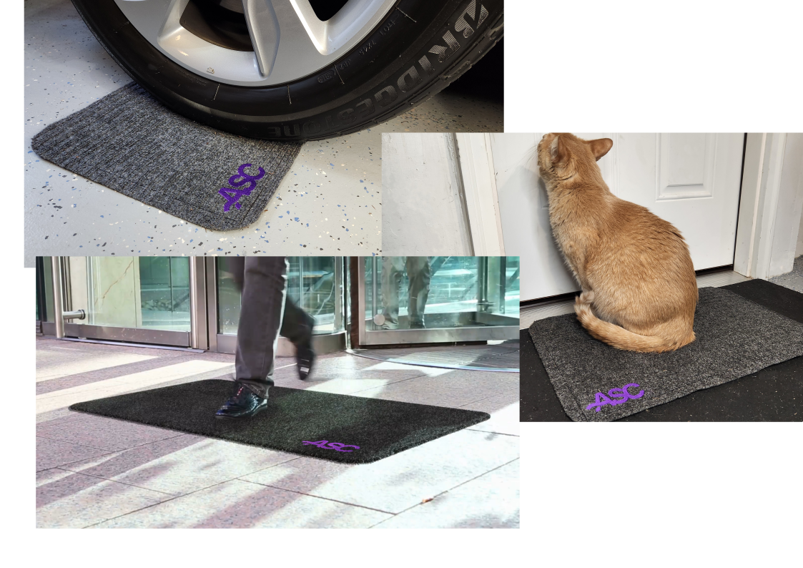

# Welcome to the documentation for TrampleTek Blue (Home Assistant version)!

This documentation will help you through the hardware setup for Home Assistant and through some troubleshooting if things don't go quite as smoothly as expected.

## If you're here to install your mat into Home Assistant, let's get started by checking to make sure you have the [Requirements](https://ascmats.github.io/requirements.html) ready.

## If you want to revert your mat back to the original TrampleTek Blue (Bluetooth socket version) go [here](https://ascmats.github.io/TTB_restore.html).

### Please join the [ASC Discord server](https://discord.gg/cB9P6NmYJg) if you have issues, questions, or suggestions for the documentation.

You can also reach out to hello@asc.com for additional questions about ASC.

Link to the github repo for these web page is [here](https://github.com/ascmats/ascmats.github.io).
