# Loading ESPHome on the TrampleTek Blue mat

## These instructions are for default Home Assistant UI with the ESPHome add-on
If you are not using the default Home Assistant with the ESPHome add-on (e.g. you're running Docker on a Linux machine), you will need to alter the instructions for your needs. If you're a tech wizard enough to use Home Assistant in an advanced setup (like Docker/Linux) I believe you'll figure it out. You may need to use the command line instructions for ESPHome [here](https://esphome.io/guides/getting_started_command_line.html) to achieve installation.

## These are step-by-step instructions

- Open ESPHome in the Settings -> Add-ons section.

-	Open the Web UI.

-	Add a new device.

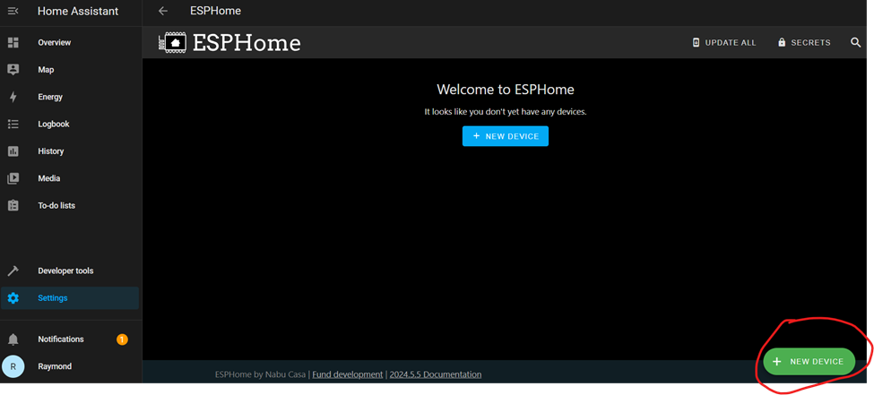

-	Press Continue.

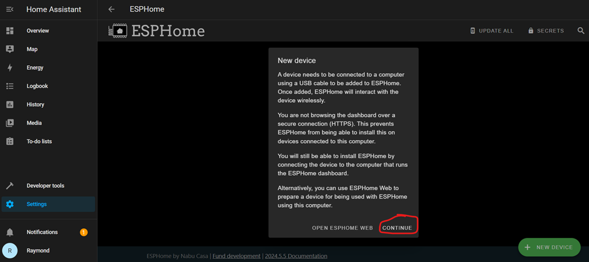

For now we will use the ESPHome web interface, as there are steps we need to take to make sure the board's Wi-Fi is configured to be stable enough to connect with Home Assistant. This is the [critical fix](https://ascmats.github.io/critical_wifi.html) I mentioned in a previous section.

-	Pick a name for your mat.

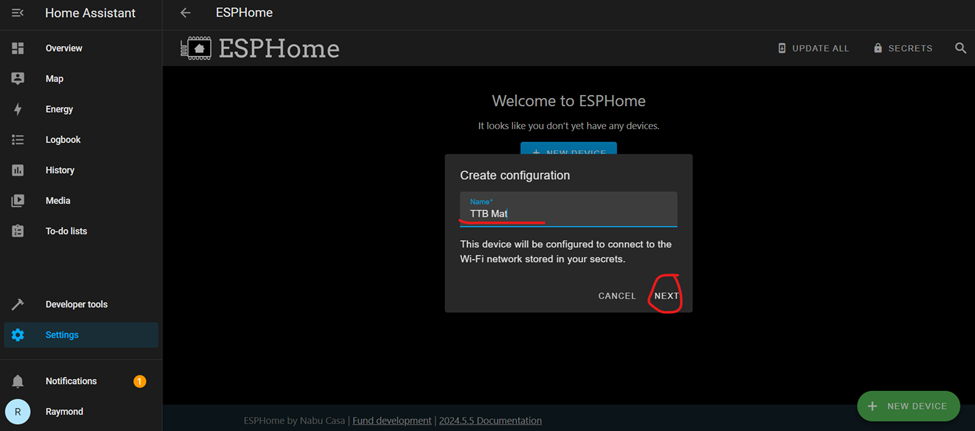

I find shorter is better for keeping the Home Assistant interface elements less crowded.

-	Pick ESP32-C3, that’s the micro-controller brain we’re using.

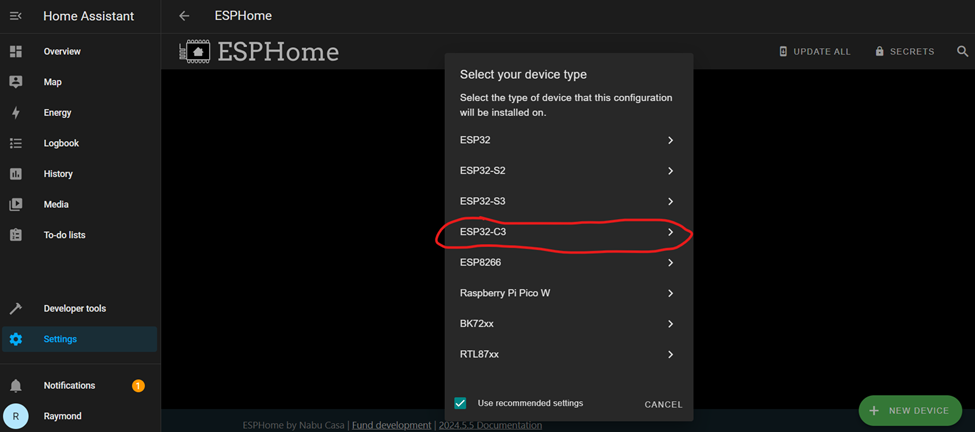

-	Your new device will show up in the background, and it will prompt you to pick an encryption key. Go ahead and press “Install” after you keep or change the encryption key.

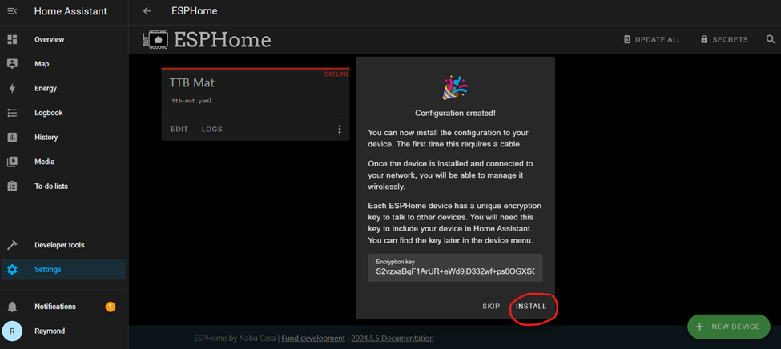 

-	Connect your mat to your computer using the USB-C to USB cable that came with the mat and pick “Plug into this computer.”

 

Side note: I think the simplest option is actually “Plug into the computer running ESPHome Dashboard” (for me, the Raspberry Pi running Home Assistant), but not everyone has easy access to their Home Assistant device. I will not cover the instructions for that option here, but feel free to explore that option if you’re interested.

-	This step may take 4+ mins, and all you will see is the spinning blue circle to let you know something is happening. It takes so long because it’s compiling the project from scratch and then downloading it.

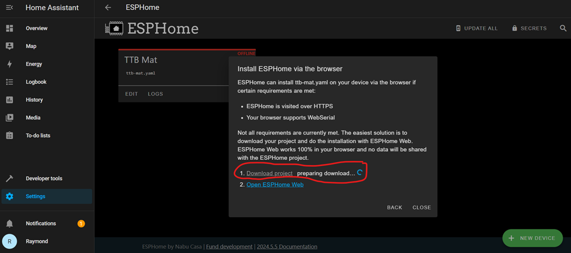 

-	Eventually option “1. Download project” will go blue to show it’s ready, click on it.

 

-	A new pop up will show up, pick “Modern format.”

  

-	Depending on your browser it may identify the [your device name].bin file as insecure or unknown, you may need to press “keep” or accept this unknown file.

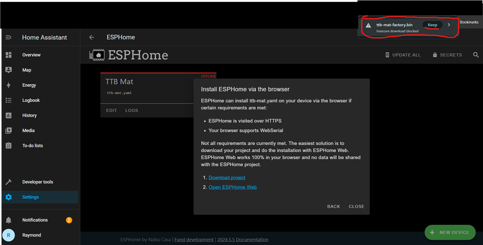 

-	Now we press the next step, “2. Open ESPHome Web.”

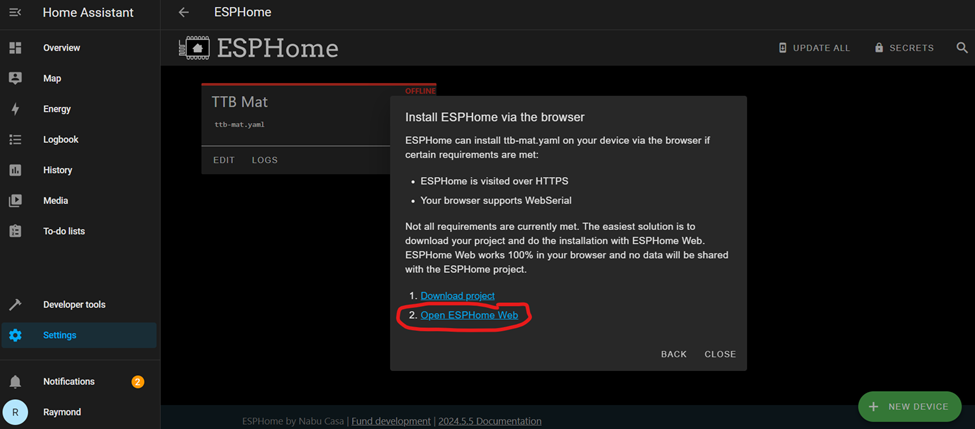  

-	The ESPHome Web interface is not supported on all browsers (e.g. Safari), you will need Chrome or another browser that supports ESPHome Web. ESPHome Web will open a new tab on your browser, press “Connect” to start looking for the device:

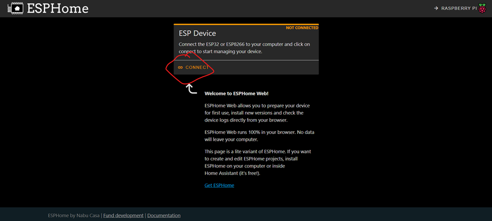 

-	This pop up will show up and you have need to figure out which device is your TrampleTek Mat, and what COM port it is on (mine was COM28 in this example). With the pop up window open you may be able to unplug and re-plug the USB cable in and see which COM port appears and disappears. This usually takes me a couple tries to figure out the COM port and make sure the device is “available” to the computer.

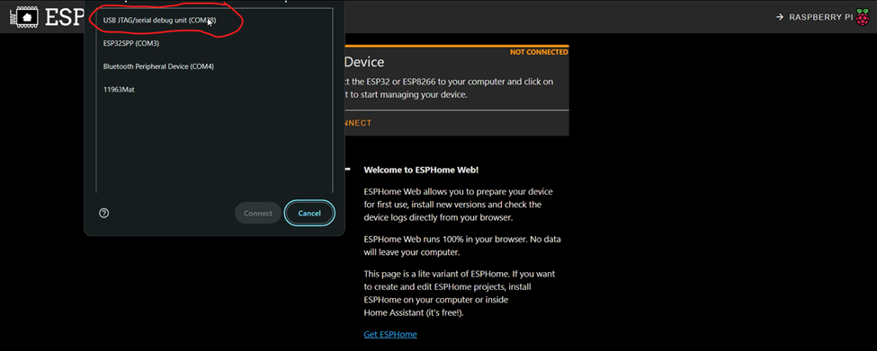 

-	Once you get the right COM port pick this option, to install the [your mat name].bin file you just download.

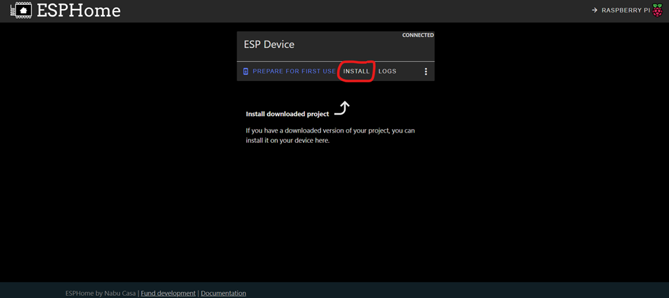 

-	This will open a new pop up, click “Choose file” and navigate to wherever you downloaded your [your device name].bin. Select the file and click open (the open button was cut off in the image below, it’s on the right).

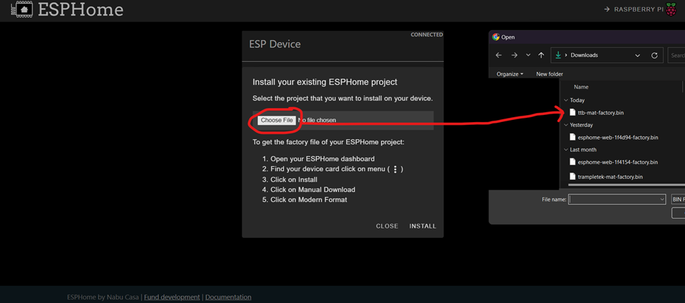 

-	Click Install.

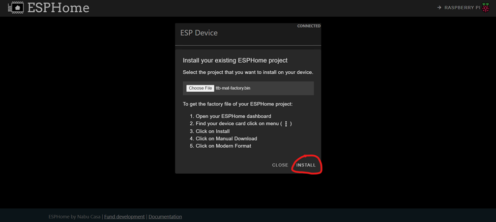

WARNING: THIS STEP MIGHT FAIL! That’s okay, it just means the computer can’t (or made a mistake and didn’t) put the mat into Boot Mode. Sometimes you can disconnect and reconnect the mat (you will need to redo the previous step on connecting to the mat with ESPHome web) and then the install button will work. If you continue to get an error about “timing out” you will to manually put the mat into Boot Mode. [Boot Mode Instructions](https://ascmats.github.io/bootmode.html).

-	If the install starts working, you’ll start seeing loading:

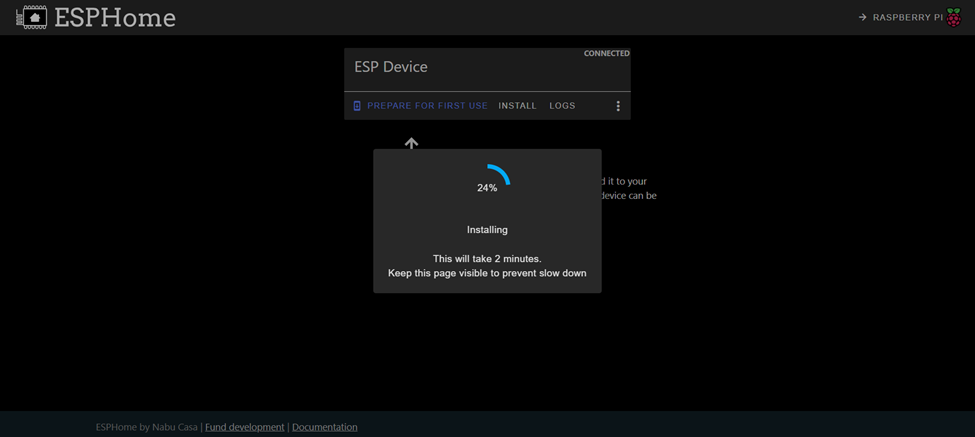 

-	When it’s done you’ll see this!

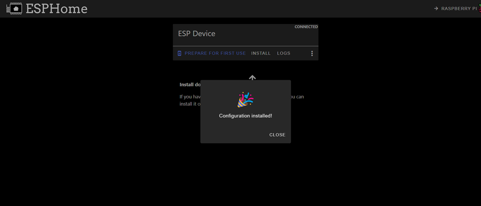

## Next Steps
Let's move on to setting up the YAML code on the mat [Yaml Code Installation](https://ascmats.github.io/yamlcode.html).

## Ignore this section, active testing happening

  <esp-web-install-button manifest="https://raw.githubusercontent.com/ASCKing9/TrampleTek-Blue-code/main/TrampleTekBlue.json" install-supported="">
        <i slot="unsupported">
          Install with this button is not available because your browser does not support Web
          Serial. Open this page in Google Chrome or Microsoft Edge instead
            (but not on your iOS device).
        </i>
      </esp-web-install-button>

