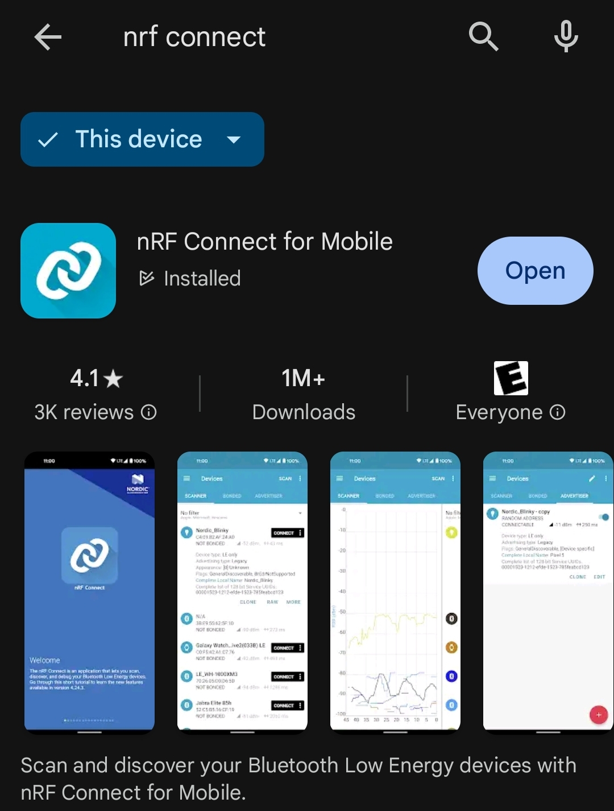
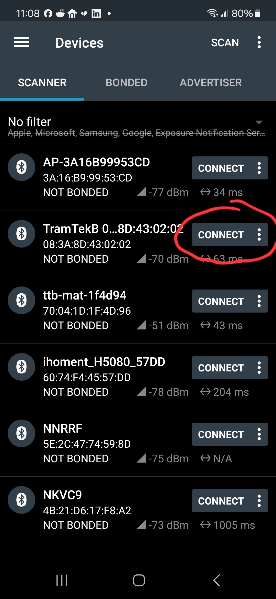
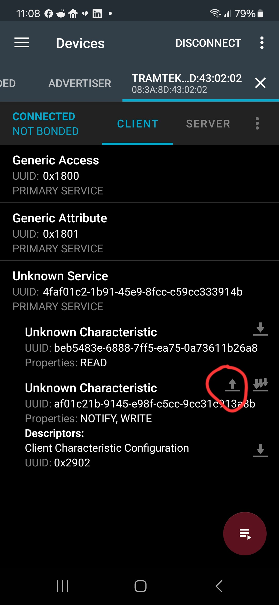
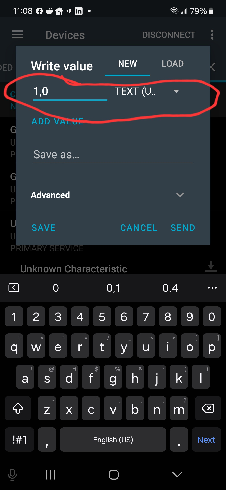

# Instructions for Hacking the (Optional) Bluetooth Socket

### Note:
These instructions are **NOT** on how to connect the Bluetooth socket to Home Assistant. For that, visit the [Home Assistant forums](https://community.home-assistant.io/).

## Prerequisites
This section assumes you're a tech wizard of some level and that you have the **ASC Bluetooth socket** (optional with your purchase). If you have a Bluetooth device scanner, you can skip to the bottom to view the possible commands you can send to the socket.

---

### Step 1: Connect the ASC Bluetooth Socket
- **Plug in your ASC Bluetooth socket**. Ensure the LED is flashing blue, indicating it’s in pairing mode.
  - If the LED is solid blue, the socket is already connected to one of your mats or another Bluetooth device. **Unplug any paired mat and disconnect other Bluetooth devices** that may be using the socket.

### Step 2: Download a Bluetooth Scanner
- If you don’t have a Bluetooth scanner, download "nRF Connect" by Nordic Semiconductor on Windows, Android, or Apple devices.

### Step 3: Scan for Bluetooth Devices
- Open **nRF Connect**, press the **Scan** button at the top, and find the Bluetooth device starting with **"TramTek"**. Tap **Connect**.

### Step 4: Access the Bluetooth Socket's Characteristics
- Tap on the **"Unknown Service"**, then tap the **up-arrow** on the **"Unknown Characteristic"** with **"NOTIFY, WRITE"** properties (UUID numbers are listed at the end of these instructions).

### Step 5: Send Commands
- Select **"TEXT (UTF-8)"** from the drop-down menu, and then send any of the following commands:

---

## Commands for the Bluetooth Socket
All commands are sent as **UTF-8 text** (without quotation marks). Here are the available commands:

- **"1,0"** - Turn on indefinitely.
- **"0,0"** - Turn off indefinitely.
- **"1,x"** - Turn on, then turn off after **x** milliseconds (e.g., `1,5000` to turn on, wait 5 seconds, then turn off).
- **"0,x"** - Turn off, then turn on after **x** milliseconds (e.g., `0,5000` to turn off, wait 5 seconds, then turn on).

---

## UUIDs for Bluetooth Services and Characteristics
- **UUID Service #**: `4faf01c2-1b91-45e9-8fcc-c59cc333914b`
- **UUID Characteristic #**: `af01c21b-9145-e98f-c5cc-9cc31c913a8b`
