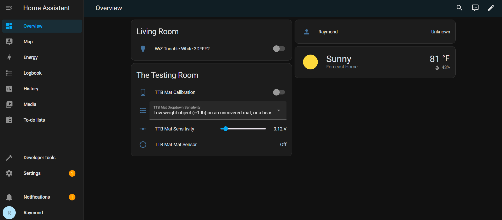
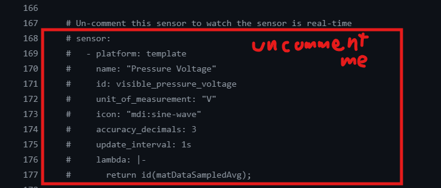
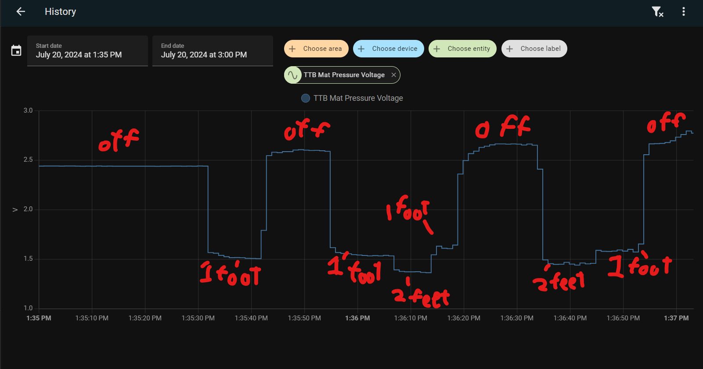

# Explanation of the User Interface (UI) elements of the TrampleTek Blue (Home Assistant version)

## User Interface Overview

The UI is seperated into four visible components **"Calibration"**, **"Dropdown Sensitivity"**, **"Sensitivity"**, and **"Mat Sensor"** and one secret component (not in this image) for power users **"Pressure voltage"**. 

Your UI elements may show up in a different order, and I will explain them from simpliest to most complex. Note: I will use "pressure" and "weight" interchangeably in this section, they are technically different but for ease of examples I use them interchangeably.

### Mat Sensor monitor

This component is as simple as it gets, it just shows when the mat has been triggered to on or off. This is most likely the entity you will use to trigger your HA automations.

### Dropdown Sensitivity

(WARNING: ALL MATS HAVE SLIGHTLY DIFFERENT SENSITIVITY, take all weight values below as rough estimates as they could differ greatly from one mat to another.)

This component sets the sensitivity of the mat from a drop down menu. The five options are long to help explain them in the UI, the options are:

**1) Low weight object (<1 lb) on an uncovered mat, or a heavy weight object on a heavy weight covered mat (e.g. adult human with mat under mattress). Very sensitive, may cause false triggering**

- This option makes the mat very sensitive, so sensitive that it may trigger when it imagines something on it. This setting is not recommended unless you are trying to use it as a bed occupancy monitor.

**2) Low weight object (~1 lb) on an uncovered mat, or a heavy weight object on a medium weight covered mat (e.g. adult human with mat under rug)**

- This option is great for making sure your mat triggers for light packages or animals, it is the recommended default setting for high sensitivity with very few mistakes.

**3) Medium weight object (~1-20 lb) on an uncovered mat, or a heavy weight object on a light weight covered mat (e.g. adult human with mat under light rug)**

- This option is for triggering the mat with sizable objects, it may still trigger for small animal and packages, but if you put the mat under a cushion or rug then it will take a grown adult amount of weight to trigger the mat.

**4) Heavy weight object (>20 lb) on an uncovered mat, not likely to work well if mat is covered**

- This option is for triggering the mat only with heavy objects, this will likely never trigger for small or medium sided animals or packages. This is a great option if you want to use the mat to detect a car tire.

**5) Custom**

- This means you've selected a custom sensitivity from the "Sensitivity" slider (which is the next UI element!).

### Sensitivity

You can manually change the sensitivity of the mat with this slider. Increase this value to have the mat trigger on/off only on heavier weights, or decrease this value to have the mat trigger on/off on a lighter weight.

### Calibration

If you're not sure what the Sensitivity should be for your use case use, use the Calibration button!

**<ins>How to use the Calibration button:</ins>**
- Load your mat with whatever you want the mat's baseline to be (e.g. if you're using it as a bed sensor put it under the matress where you sleep, if you want it sense someone on the coach put it under the coach cushion, etc.).
- Wait 1-2 minutes for the mat signal to fully settle
- Switch the Calibration button to "On"
- Put whatever the object you want to sense on the mat (e.g. lay down on your bed for the matress sensor, sit on the cushion that you want to sense a person on, etc.)
- The Sensitivity slider will automatically update to roughly where you should set the Sensitivity for your use case
- Switch the Calibration button to "Off"

Calibration is not perfect! You may want to move the Sensitivity slider around a little bit to fine tune when the mat triggers on/off.

## Advanced UI and details
### Pressure voltage

To get to the Pressure voltage UI you have to un-comment this section in the YAML code and install the change onto the mat.

With this UI entity you can watch the voltage of the mat change as weight is put on or taken off the mat. 

This is an example of the voltage plot as I stand on and off the mat with 1 and then 2 feet. This UI element is a fun way to explore the mat and trigger automations directly from voltage changes.

### Extra: Technical notes
- The Sensitivity value is the voltage change required to trigger "on" for the mat. The "off" trigger is a percentage of this value. This is because the mat can recover slowly from heavy or large objects and requiring less of a voltage change when weight comes off helps increase the responsiveness of the mat. You can get rid of this by removing the variable "scaleThreshold" in the YAML code. Look for this line **matUpThreshold = matDataAvg + id(step_event_threshold) * scaleThreshold; // Recovery can be slower, reduces the threshold requirement**

- The voltage change for the same weight can be different depending on how much weight is already on the mat (e.g. the first 10lbs on the mat might change the voltage by 0.5 V but another 10lbs may only change the mat voltage by an additional 0.1 V). The mats are tuned to be very sensitive to low weights, <20 lbs), but struggle to tell the different between 100 lbs and 1000 lbs. 
  
- **<ins>Every mat's voltage range and sensitivity is different</ins>**. Textiles and soft stretchy materials do not always line up the exact same way for each mat build, so there is an expected, and sometimes sizable, varability between mats. If you have multiple mats, do not expect the same Sensivitiy level to work for all your mats for the same use case.

If you have more technical questions you can alway contact me at Raymond@asc.com

## Secret button from Travis

<esp-web-install-button manifest="https://raw.githubusercontent.com/ASCKing9/TrampleTek-Blue-code/refs/heads/main/TrampleTek_Debug/WeightExclusionBeta/TrampleTekBlue_ExWeight.json" install-supported="">
        <i slot="unsupported">
          The option is not available because your browser does not support Web
          Serial. Open this page in Google Chrome or Microsoft Edge instead
            (but not on your iOS device).
        </i>

